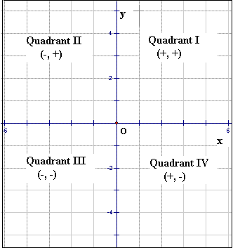

## Simple Math
-  `if  n & 1 == 1` Odd Number else Even number.
- 2 D Plane :
    

#### Fibonacci Series
>(0,1,1,2,3,5,8,...)

```
A[0] = 0
A[0] = 1
A[n] = A[n-2] + A[n-1]
```
#### Eulers Totient Function
For an input n is the count of numbers in `{1,2,3,...,n-1}` that are relatively prime to n.
*i.e, the numbers whose GCD == 1 with n is 1*

```
GCD(int a,int n){
    gcd = 0;
    for(int i = 0;i <= a && i <= n>;i++){
        if(a % i == 0 && n % i == 0) gcd = i;
    }
    return gcd;
}
```
`for two numbers to be co-prime there GCD must be 1.`

#### Primality Test


$n = 12$
The factors of $n$ will be:
$(6,2) (12,1)(3,4)$

$\sqrt{12} = 3.46$

In the above example we can see that smaller number of the factor can never be above $\sqrt{n}$, hence if we need to check the prime numbers for a given number we can modify range checkpoint till $\sqrt{n}$.

So, the code will be like.
```
for(int i = 0;i < sqrt(n);i++)
OR
for(int i = 0;i*i < n;i++)
```

**Adding two integer by maintaining carry.**
```
Loop:
    sum = a + b + carry
    dec = (sum % 10)
    carry = sum / 10
    ans.add(dec % 10)
```


