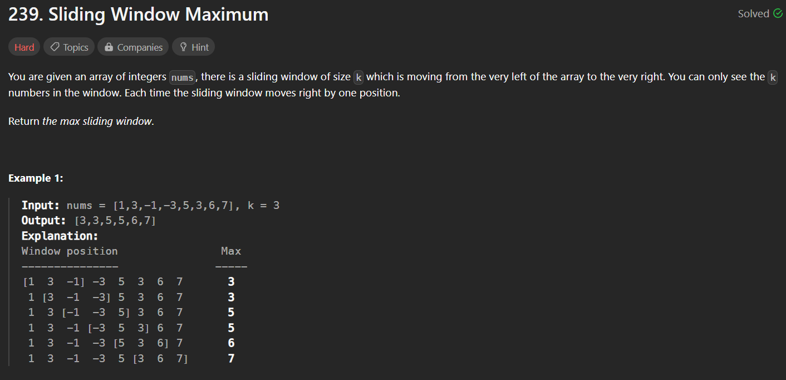

# Arrays
- [x] Two Pointers
- [x] Prefix Sum
- [x] Sorting
    - [x] Bubble
    - [x] Selection
    - [x] Insertion
    - [x] Merge
    - [x] Quick
    - [x] Problems
- [x] Kadanes Algorithm
- [x] Binary Search
- [x] Sliding Window
- [ ] Bit Manipulation

**Dictionary:**
- DNC : Do Not Consider
- RTQ : Repeat The Question
- NTO : Need To Optimize
---
### Two Pointers
1. **Two Sum**
    https://leetcode.com/problems/two-sum-ii-input-array-is-sorted/
    `Arrays must be sorted.`

    >Given a 1-indexed array of integers numbers that is already sorted in non-decreasing order, find two numbers such that they add up to a specific target number. Let these two numbers be numbers[index1] and numbers[index2] where 1 <= index1 < index2 < numbers.length.
    Return the indices of the two numbers, index1 and index2, added by one as an integer array [index1, index2] of length 2.

    The tests are generated such that there is exactly one solution. You may not use the same element twice.
    Input: $A = [2,7,4,11]$
    Target : $9$
    Considering above input.
    consider two pointers $i , j$
    $n = length.A$
    $i = 0$
    $j = n -1$

    - if the $(sum = A[i] + A[j] ) > target$ we need to decrement j pointer &larr; so that sum will be smaller.
    - else if $(sum = A[i] + A[j] ) < target$ we need to increment i pointer &rarr; so that sum will be greater.
    ```
        int i = 0;
        int j = numbers.length - 1,sum = 0;
        while (i < j){
            sum = numbers[i] + numbers[j];
            if(sum > target) j--;
            else if(sum < target) i++;
            else return new int[]{i+1,j+1};
        }
        return null;
    ```
2. **Three Sum**
    https://leetcode.com/problems/3sum/description/
    >Given an integer array nums, return all the triplets [nums[i], nums[j], nums[k]] such that i != j, i != k, and j != k, and nums[i] + nums[j] + nums[k] == 0.
    Notice that the solution set must not contain duplicate triplets.

    

    Consider 3 pointer $i,j,k$
    Keep pointer i at one place and perform two sum using $j,k$ where $j = i + 1,k = n-1 $ and range of $n$ will be $i < n-2$

    ```
        Arrays.sort(nums);
        int j,k,sum;
        int n = nums.length;
        List<List<Integer>> result = new ArrayList<>();
        List<Integer> temp;

        for(int i = 0; i < n-2;i++){
            j = i + 1; k = n - 1;
            if(i > 0 && nums[i-1] == nums[i]) continue;
            while(j < k){
                sum = nums[i] + nums[j] + nums[k];
                if(sum < 0) j++;
                else if(sum > 0) k--;
                else{
                    temp = new ArrayList<>();
                    temp.add(nums[i]);
                    temp.add(nums[j]);
                    temp.add(nums[k]);
                    result.add(temp);
                    ++j;
                    while(nums[j] == nums[j-1] && j < k)    ++j;
                }
            }
        }

        return result;
    ```
3.  **Container With Most Water**
    >You are given an array of N non-negative integers where each represents the height of a line. N vertical lines are drawn at points marked 1 to n on the x axis as shown in the diagram. Find two lines, which together with the x axis forms a container, such that the container holds the most water. Assume the width of lines to be negligible.
    Note: You may not slant the container and n is at least 2.
    
    

    ```
    public int maxArea(int[] A) {
        int i = 0, j = A.length - 1;
        int l,w;
        int result = 0;

        while(i < j){
            l = Math.min(A[i],A[j]);
            w = j - i;
            if(A[i] < A[j]){
                while(A[i] <= l && i < j) i++;
            }else{
                while(A[j] <= l && i < j) j--;
            }
            
            result = Math.max(result,l*w);
        }

        return result;
    }
    ```
    Take two pointer $i, j$ keep initially $i =0,j = n - 1$ take the $width = j - i$  and $len = min(A[i],A[j])$
    - `l = Math.min(A[i],A[j])`         `w = j - i;`
    - keep pushing i &rarr; `if(A[i] < A[j]) : while(A[i] <= len && i < j) i++;` 
    - keep pushing j &larr; `if(A[i] > A[j]) : while(A[j] <= len && i < j) j--;` 
    - Keep calculating for every iteration : `result = Math.max(result,l*w)`
    - As the water will fill till the brim of column with smaller length.
4. **Merge Intervals**
    >Given an array of intervals where intervals[i] = [starti, endi], merge all overlapping intervals, and return an array of the non-overlapping intervals that cover all the intervals in the input.

    
    I have taken initial $start,end$ variable as first interval after sorting the interval based on start time (As my comparison is based on $end$ variable), then checked whether the $end$ comes under end time of next interval if so I assign new $end$ as the next interval and take $start = min(newIntervalStart,start)$ or else I check $end$ is beyond new interval start and end if so I add the new interval to list.


    >*Taking two pointers as start and end, then moving end till condition satisfies if not then setting new start and end*

    ```
        public int[][] merge(int[][] A) {
        List<int[]> mergedIntervals = new ArrayList<>();
        Arrays.sort(A,Comparator.comparingInt(a -> a[0]));
        int start = A[0][0];
        int end = A[0][1];

        for(int i = 1;i < A.length;i++){
            if(end < A[i][1] && end >= A[i][0] ){
                end = A[i][1];
                start = Math.min(start,A[i][0]);
            }
            else if(end < A[i][1] && end < A[i][0]){
                mergedIntervals.add(new int[]{start,end});
                start = A[i][0];
                end = A[i][1];
            }
        }

        mergedIntervals.add(new int[]{start,end});
        int[][] result = new int[mergedIntervals.size()][2];

        for(int i = 0;i < result.length;i++){
            result[i] = mergedIntervals.get(i);
        }

        return result;
    }
    ```
    ---
### Prefix Sum
1. **Subarray Sum Equals K**
    > Given an array of integers nums and an integer k, return the total number of subarrays whose sum equals to k.
    A subarray is a contiguous non-empty sequence of elements within an array.

    
    ```
        public int subarraySum(int[] nums, int k) {
        int sum = 0,count = 0;
        Map<Integer,Integer> preSum = new HashMap<>();
        preSum.put(0,1);
        for(int i : nums){
            sum += i;
            count += preSum.getOrDefault(sum-k,0);
            preSum.put(sum,preSum.getOrDefault(sum,0)+1);
        }
        return count;
    }
    ```
    initially setting hashmap $(key:0,value:1)$ `preSum.put(0,1)` because we are storing prefixSum in the map and finding whether the given $prefixSum - k = 0$ if so $0$ will be queried in map and $1$ will be returned which will get added to count.
    
    `Dry run the code for A = [1,2,3] input taking 3 as a target.`
    - `map`&rarr;`(0,1)`
    - `A[0] = 1, prefixSum = 1 `&rarr;`map`
    - `A[1] = 2, prefixSum = 3 `&rarr;`prefixSum - k == 0`&rarr;`count++`&rarr;`map`
    - `A[2] = 3, prefixSum = 6`&rarr;`prefixSum - k = 3`&rarr;`3 present in map`&rarr;`count++
    - `result: 2`

    ```
    sum += i;
    count += preSum.getOrDefault(sum-k,0);
    preSum.put(sum,preSum.getOrDefault(sum,0)+1);
    ```
2. **Continuous Subarray Sum**
    
    > Given an integer array nums and an integer k, return true if nums has a good subarray or false otherwise.
    A good subarray is a subarray where:
    its length is at least two, and
    the sum of the elements of the subarray is a multiple of k.`
    Note that:
    A subarray is a contiguous part of the array.
    An integer x is a multiple of k if there exists an integern such that x = n * k. 0 is always a multiple of k.

    

    ```
    public boolean checkSubarraySum(int[] nums, int k) {
        if(nums.length < 2) return false;

        Map<Integer,Integer> preSum = new HashMap<>();
        int sum = 0;
        preSum.put(0,-1);

        for(int i = 0;i < nums.length;i++){
            sum += nums[i];
            sum %= k;
            if(preSum.containsKey(sum)){
               if(i - preSum.get(sum) > 1)  return true;
            } 
            else    preSum.put(sum,i);
        }
        return false;
    }
    ```
    Solution is just sightly different than above one, in this we are storing remainder with index instead of prefixSum.
    So, if the reminder is repeated it checks whether the length of the $presentIndex - index > 1$ if so it return true.
         
3. **Longest Subarray Without Repeating Characters**
    >Given a string s, find the length of the longest substring without repeating characters.

    
    ```
    public int lengthOfLongestSubstring(String s) {
    int n = s.length();
    if(n == 0) return 0;
    if(n == 1) return 1;

    int[] A = new int[300];
    int start = 0;
    int end = 1;
    int max = 0;
    A[s.charAt(start)]++;

    while(end < n){
        if(A[s.charAt(end)] == 1)   A[s.charAt(start++)]--;
        else A[s.charAt(end++)]++;
            
        max = Math.max(max,end - start);
    }

        return max;
    }
    ```
    - Maintaining count array and two pointers `start` and `end` initially keeping them at $0,1$ respectively.
    - and then iterating over string and incrementing the count array with value of character encountered.
    - if the repeating character is  found `if(A[s.charAt(end)] == 1)` start pointer is incremented and value at start index is decrementd.
    - `max = Math.max(max,end - start);` is calculated at every loop to get longest string.
---
### Sorting
1. **Bubble Sort**

    - traverse from left and compare adjacent elements and the higher one is placed at right side. 
    - In this way, the largest element is moved to the rightmost end at first. 
    - This process is then continued to find the second largest and place it and so on until the data is sorted.
    ```
    public static void bubbleSort(int arr[], int n)
    {
        for(int i = 0;i < n - 1;i++){
            for(int j = 0;j < n-i-1;j++){
                
                if(arr[j] > arr[j+1]){
                    int temp = arr[j+1];
                    arr[j+1] = arr[j];
                    arr[j] = temp;
                }
            }
        }
    }
    ```
2. **Selection Sort**
The algorithm repeatedly selects the smallest (or largest) element from the unsorted portion of the list and swaps it with the first element of the unsorted part. This process is repeated for the remaining unsorted portion until the entire list is sorted. 
    ```
	int  select(int arr[], int i)
	{
        // code here such that selectionSort() sorts arr[]
        int minIndex = i;
        for(int j = i;j < arr.length;j++){
            if(arr[j] < arr[minIndex]){
                minIndex = j;
            }
        }
        return minIndex;
	}
	
	void selectionSort(int arr[], int n)
	{
	    //code here
	    for(int i = 0;i < n;i++){
	        int minI = select(arr,i);
	        
	        int temp = arr[i];
	        arr[i] = arr[minI];
	        arr[minI] = temp;
	    }
	}
    ```
3. **Insertion Sort**
    ```
    static void insert(int arr[], int i) {
        int valueToInsert = arr[i];
        int holePosition = i;

        while (holePosition > 0 && arr[holePosition - 1] > valueToInsert) {
            arr[holePosition] = arr[holePosition - 1];
            holePosition--;
        }

        arr[holePosition] = valueToInsert;
    }

    // Function to sort the array using insertion sort algorithm.
    public void insertionSort(int arr[], int n) {
        for (int i = 1; i < n; i++) {
            if (arr[i] < arr[i - 1]) {
                insert(arr, i);
            }
        }
    }
    ```
    -   Start with the first element; it's already sorted (an array of one element is sorted).
    -   Move through the unsorted elements.
    -   Compare each element to its predecessors and find its correct position in   the sorted part.
    -   Insert the element by shifting greater ones to make space.
    -   Repeat this for all elements.
    -   The array is sorted when done.

4. **Merge Sort**
    ```
    void merge(int arr[], int l, int m, int r)
    {
        int n1 = m - l + 1;
        int n2 = r - m;
         
        int[] L = new int[n1];
        int[] R = new int[n2];
        
        //assign values
        for(int i = 0;i < n1;i++){
            L[i] = arr[l + i];
        }
        
        for(int i = 0;i < n2;i++){
            R[i] = arr[m + i + 1];
        }
        
        int i = 0, j = 0;
        int k = l;
        
        while(i < n1 && j < n2){
            if(L[i] < R[j]) arr[k++] = L[i++];
            else    arr[k++] = R[j++];
        }
        
        while( i < n1 ){
            arr[k++] = L[i++];
        }
        
        while( j < n2 ){
            arr[k++] = R[j++];
        }
    }
    void mergeSort(int arr[], int l, int r)
    {
        if( l < r ){
            int m = l + (r-l)/2;
            
            mergeSort(arr,l,m);
            mergeSort(arr,m+1,r);
            
            merge(arr,l,m,r);
        }
    }
    ```
    - **Divide**: Split the array into two halves.
    - **Conquer**: Recursively sort each half.
    - **Merge**: Combine the sorted halves into a single sorted array.
    - Repeat the process until the entire array is sorted.

4. **Quick Sort**
        <iframe width="560" height="315" src="https://www.youtube.com/embed/WprjBK0p6rw?si=JQr-ATss_2dbLGZ7" title="YouTube video player" frameborder="0" allow="accelerometer; autoplay; clipboard-write; encrypted-media; gyroscope; picture-in-picture; web-share" allowfullscreen></iframe>
    -   **Choose a Pivot**: Select any element from the array as the pivot.
    -   **Partition**: Rearrange elements so that elements less than the pivot are on the left, and elements greater than the pivot are on the right.
    -   **Recursion**: Recursively apply QuickSort to the subarrays on the left and right of the pivot.
    -   **Base Case**: When the subarrays become small enough (e.g., have one or zero elements), they are considered sorted.
    -   **Combine**: As the recursion unwinds, the sorted subarrays are combined to form the final sorted array.    
    ```
    static void swap(int[] arr, int i, int j)
    {
        int temp = arr[i];
        arr[i] = arr[j];
        arr[j] = temp;
    }
    
    //Function to sort an array using quick sort algorithm.
    static void quickSort(int arr[], int low, int high)
    {
        // code here
        if(low < high){
            int pi = partition(arr,low,high);
            
            quickSort(arr,low,pi-1);
            quickSort(arr,pi+1,high);
        }
    }
    static int partition(int arr[], int low, int high)
    {
        // your code here
        int pivot = arr[high];
        int i = low - 1;
        
        for(int j = low;j < high;j++){
            if(arr[j] < pivot){
                swap(arr,++i,j);
            }
        }
        
        swap(arr,i+1,high);
        return i+1;
    } 
    ```
    ---
### Kadanes Algorithm
- **Algorithm**
    ```
    Initialize:
        max_so_far = INT_MIN
        max_ending_here = 0

    Loop for each element of the array

    (a) max_ending_here = max_ending_here + a[i]
    (b) if(max_so_far < max_ending_here)
                max_so_far = max_ending_here
    (c) if(max_ending_here < 0)
                max_ending_here = 0
    return max_so_far
    ```
    *Also works for negative max sum.*
    ```
    int max_subarray_sum(int a[], int n){
    int current_max = 0;
    int max_so_far = INT_MIN;
    for(int i=0; i<n; i++){
        current_max = max(current_max + a[i], a[i]); 
        max_so_far = max(current_max, max_so_far);
    }
    return max_so_far;
    }
    ```
1. **Maximum Sum Circular Subarray**
    
    ```
    public int maxSubarraySumCircular(int[] nums) {
        int curMax = 0,globalMax = nums[0],curMin = 0,globalMin = nums[0],total = 0;
        for(int x : nums){
            curMax = Math.max(curMax + x,x);
            globalMax = Math.max(curMax,globalMax);
            curMin = Math.min(curMin + x,x);
            globalMin = Math.min(curMin,globalMin);
            total += x;
        }
        return globalMax > 0 ? Math.max(globalMax,total - globalMin) : globalMax;
    }
    ```
    - Applying kadanes algorithm and calculating `curMax` and `globalMax`, also calculating `curMin`, `globalMin`, and `total`
    - We are calculating `curMin`, `globalMin`, and `total` because the array is circular.
    - if we consider array as $(5,-3,5)$ here values will be:
        - `curMax = 5` //DNC
        - `globalMax = 5` 
        - `curMin = -3` //DNC
        - `globalMin = -3`
        - `total = 7`
    - As we know arr[n-1] &rarr; arr[0], array is circular.
    - So, we can minus out minimum part from total of the array.
    - $ans = total - globalMin = 7 - (-3) = 10$

2. **Maximum Product Subarray** 
    
    ```
    public int maxProduct(int[] nums) {
        int n = nums.length;
        int max = nums[0], min = nums[0], ans = nums[0];

        for(int i = 1; i < n;i++){
            int tempmax = max,x = nums[i];
            max = Math.max(Math.max(x * min,x * max),x);
            min = Math.min(Math.min(x * min,x * tempmax),x);

            if(max > ans)   ans = max;
        }

        return ans;
    }
    ```
    RTQ
    > - Calculating minimum and maximum number at every iteration and multiplying them to get the maximum number possible
    > - we are doing soo because if we apply kadanes algorithm it will jump once the value goes negative 
    > - But here we are considering product so we have to consider that product of two negative might form big positive number.
    > - Hence, we are calculating min number.
---
### Binary Search
> Constantly keeps dividing sorted array in half until the target value is found, by maintaining `left`,`right` and `mid = left + (right - left)/2` *(To handle data overflow.)* 

**Pseudo Code**
```
function binarySearch(array, target):
    left = 0
    right = length(array) - 1

    while left <= right:
        middle = left + ((right - left) / 2)  //For handling integer overflow

        if array[middle] == target:
            return middle  // Target found
        else if array[middle] < target:
            left = middle + 1  // Search the right half
        else:
            right = middle - 1  // Search the left half

    return -1  // Target not found
```

1. **Find First and Last Position of Element in Sorted Array**
     
    ```java
    public int[] searchRange(int[] nums, int target) {
        int[] result = {-1,-1};
        
        if(nums.length == 0) return result;

        result[0] = findFistOccurance(nums,target);
        result[1] = findLastOccurance(nums,target);
        return result;
    }

    int findFistOccurance(int[] nums,int target){
        int left = 0,right = nums.length - 1;
        int mid,ans = -1;

        while(left <= right){
            mid = left + (right - left)/2;

            if(nums[mid] == target){
                ans = mid;
                right = mid - 1;
            }
            else if(nums[mid] < target) left = mid + 1;
            else    right = mid - 1;
        }

        return ans;
    }

    int findLastOccurance(int[] nums,int target){  
        
        int left = 0,right = nums.length - 1;
        int mid,ans = -1;

        while(left <= right){
            mid = left + (right - left)/2;

            if(nums[mid] == target){
                ans = mid;
                left = mid + 1;
            }
            else if(nums[mid] < target) left = mid + 1;
            else    right = mid - 1;
        }

        return ans;
    }
    ```
    NTO
    Need to Optimize above code by packing it in one function, here:
    - `findFistOccurance()` is finding the first occurrence of target element, by constantly moving left side &larr; (Going towards smaller values.) of the array.
    - `findLastOccurance()` is finding the last occurance of target element, by constantly moving right &rarr; (Going towards larger values.) of the array.
    - Declaring `mid` as  `mid = start + (left - right) / 2` for avoiding integer overflow.

2.  **Single Element in a Sorted Array**
    
    ```
    public int singleNonDuplicate(int[] nums) {
        int n = nums.length;
        if(n == 1) return nums[0];

        int left = 0,right = nums.length - 1;
        int mid,index;

        while( left <= right ){
            mid = left + (right - left) / 2;
            
            if(mid -1 >= 0 && mid + 1 < n && 
                nums[mid] > nums[mid-1] && nums[mid] < nums[mid+1])
                {return nums[mid];}
            else if(mid - 1 < 0 && nums[mid + 1] != nums[mid]) 
                return nums[mid]; //check if element is at first.
            else if(mid + 1 >= n && nums[mid - 1] != nums[mid])
                return nums[mid]; //check if element is at last.

            index  = mid;
            //moving till last index of element 
            while(index < n && nums[index] == nums[mid]){
                index++;
            }
            
            // if the index is even single element is after it 
            // else it is present before mid.
            if(index % 2 == 0){
                left = mid + 1;
            }else{
                right = mid - 1;
            }
        }

        return -1;
    }
    ```
    - Consider the array: $[1_1,1_2,2_3,2_4,3_5,3_6,4_7,8_8,8_9]$ with $1$ based index.
    - Here, if we observe the last occurrence of repeated element before the single element ($4$ in this case) is on the even indexes.
    - And, last occurrence of repeated element after the single element is odd.
    - Hence, with this we formed Binary Search condition.

3.  **Search in Rotated Sorted Array**
    
    
    ```
    public int search(int[] nums, int target) {
        int left = 0,right = nums.length -1,mid ;
        while(left <= right){
            mid = left + (right - left)/2;
            if( nums[mid] == target )   return mid;

            if(nums[left] <= nums[mid]){
                if(target >= nums[left] && target <= nums[mid]) right = mid - 1;
                else left = mid + 1;
            }
            else{
                if(target >= nums[mid] && target <= nums[right]) left = mid + 1;
                else right = mid - 1;
            }
        }
        return -1;
    }
    ```
    - As this is rotated sorted array we first check whether we are in greater part of smaller part of the array (ascending ) or greater part of the array (descending).
    - Then, later we check whether target exists between mid and left or right depending upon condition.
    - Then, we move the pointer.
4. **Find Minimum in Rotated Sorted Array**
    
    ```
    public int findMin(int[] nums) {
        int n = nums.length;
        int left = 0,right = n - 1,mid = 0;
        
        if(n == 1)  return nums[0];
        if(n == 2)  return nums[0] > nums[1] ? nums[1] : nums[0];

        while(left <= right){
            mid = left + (right - left) / 2;

            if(nums[mid] < nums[right]) right = mid;
            else if(nums[mid] > nums[right]) left = mid + 1;
            else right--;
        }
        return nums[left];
    }
    ```
    - Here, the approach is similar to that of above problem.We are finding which is smaller(Ascending) part of array and then performing BS on it.
    - `if(nums[mid] == nums[right])` we are moving right pointer here, cause we need to compare duh.
    - `if(nums[mid] < nums[right]) right = mid;` this means we are in descending part of the array, so we are adjusting search space to smaller part. Hence, we are `right = mid`
    
5. **Magnetic Force Between Two Balls**

    ```
    public boolean canFit(int[] positions, int m, int gap){
        int count = 1;
        int last = positions[0];
        for (int i = 1; i < positions.length; i++) {
            if (positions[i] - last >= gap) {
                last = positions[i];
                count++;
            }
        }
        return count >= m;
    }

    public int maxDistance(int[] position, int m) {
        Arrays.sort(position);
        int ans = 0;
        int l =1, r = position[position.length - 1],mid = 0;

        while(l <= r){
            mid = l + (r - l) / 2;
            if(canFit(position,m,mid)){
                l = mid + 1;
                ans = mid;
            }else   r = mid - 1;
        }
        return ans;
    }
    ```
    - Here, we have to fit in `m` balls such that `position[x] - position[y]` is minimum.
    - And ball should be split apart at maximum width.
    - For solving this we have sorted array to apply BS
    - And taken `low = l = 1` and `high = r = position[n-1] = Max(Arr)`
    - Then, we keep calculating the `mid = gap = (l+r)/2`, and declared function canFit which checks whether 3 balls can fit in the array.
    - if `true` we search for even smaller gap else move to bigger gap.
6. **Koko Eating Bananas**
    
    ```
    public int minEatingSpeed(int[] piles, int h) {
        int low = 1,mid,high = 0,ans = 0;
        for(int x : piles)  high = Math.max(high,x);

        while(low < high){
            mid = low + (high - low) / 2;
            if(canEat(piles,h,mid)) high = mid ;
            else    low = mid + 1;
        }
        return low;
    }

    public boolean canEat(int[] piles,int hour,int speed){
        int calcHours = 0;
        for(int b : piles) calcHours += (b-1)/speed + 1;
        return calcHours <= hour;
    }
    ```
    - This is similar to above problem, in this we are calculating minimum number of bananas Koko need to eat in order to complete all the bananas.
    - Here, we have taken range as `left = low =  1` and `right = high = max(piles)`
    - Then we perform BS on it and keep calling `canEat()` to check all the bananas can be eaten in the calculated `mid` hours.
    - `calcHours += (b-1)/speed + 1` in this add we are adding one and deducting 1 from numerator to get right rate (i.e., If number is not even or the banana pile is partially eaten it may result to 0; but putting +1 will save us from this.)
    - if Koko can eat all the bananas we look for even smaller rate by changing search space which is `high = mid` else if not  we look for bigger rate `low = mid + 1`
---
### Sliding Window
1. **Repeated DNA Sequences**
    
    ```
    public List<String> findRepeatedDnaSequences(String s) {
        List<String> answer = new ArrayList<>();
        Set<String> set = new HashSet<>();
        for (int i = 0; i + 9 < s.length(); i++) {
            String substring = s.substring(i, i + 10);
            if (!set.add(substring)) {
                if (!(answer.contains(substring))) {
                    answer.add(substring);
                }
            }
        }
        return answer;
    }
    ```
    ```
    public List<String> findRepeatedDnaSequences(String s) {
        int n = s.length();
        if(n < 10) return new ArrayList<String>();
        
        List<String> result = new ArrayList<>();
        Map<String,Integer> dnaMap = new HashMap<>();
        String temp;
        int start = 0, end = 10;
        
        while(end <= n){
            temp = s.substring(start++,end++);
            dnaMap.put(temp,dnaMap.getOrDefault(temp,0)+1);
            if(dnaMap.get(temp) == 2) result.add(temp);
        }

        return result;
    }
    ```
    - Maintaining window of size 10 and moving it forward by constantly capturing the substring.
    - And storing them in a HashMap(CountMap) for checking which is repeated.
2. **Minimum Size Subarray Sum**

    ```
    // By using prefix sum array
    public int minSubArrayLen(int target, int[] nums) {
        int n = nums.length;
        if (n == 1) {
            return nums[0] >= target ? 1 : 0;
        }
        int start = 0;
        int end = 0;
        int result = Integer.MAX_VALUE;
        int[] prefix = new int[n];
        prefix[0] = nums[0];
        
        for (int i = 1; i < n; i++) {
            if (nums[i] == target) {
                return 1;
            }
            prefix[i] = prefix[i - 1] + nums[i];
        }
        
        while (start <= end && end < n) {
            int sum = prefix[end] - (start > 0 ? prefix[start - 1] : 0);
            if (sum >= target) {
                result = Math.min(result, end - start + 1);
                start++;
            } else {
                end++;
            }
        }

        return result == Integer.MAX_VALUE ? 0 : result;
    }
    ```
    ```
    // By calculating prefix sum in variable.
    public int minSubArrayLen(int target, int[] nums) {
        int n = nums.length;
        int start = 0,end = 0;
        int sum = 0,result = n+1;
        for(end = 0;end < n;end++){
            sum += nums[end];
            while(sum >= target){
                result = Math.min(end - start + 1,result);
                sum -= nums[start++];
            }
        }
        return result == n+1 ? 0 : result;
    }
    ```
    -  In the above approach I am maintaining the sum variable in which I am storing the prefix sum.
    - And when this prefix sum hits the target or goes above the target, while loop gets hit and minimum length subarray having $sum >= target$ is calculated.
    - And after each calculating start pointer is moved close to end, to again see whether this can $end - start$ can make up to minimum length .

3. **Longest Repeating Character Replacement**

    ```
    public int characterReplacement(String s, int k) {
        int[] count = new int[26];
        char[] chars = s.toCharArray();

        int result = 0,i = 0,max = 0;
        for(int j = 0;j < s.length();j++){
            count[chars[j] - 'A']++;
            max = Math.max(count[chars[j] - 'A'],max);

            while((j-i+1) - max > k){
                count[chars[i++] - 'A']--;
            }
            result =  Math.max(j-i+1,result);
        }
        return result;
    }
    ```
    - Here, we maintain the count array in which we keep storing count of the alphabets on every iteration and here Start pointer is $i$ and end pointer is $j$ for the window.
    - We are maintaining the max counter for the maximum repeated alphabet, if the $max Repeated Alphabet - subArrayLength > k$ then we adjust the window by moving $start$ pointer closer (&rarr;).
    - We keep storing $maxSubarraylenght$ in `result` variable.
4. **Sliding Window Maximum**

    ```
    public int[] maxSlidingWindow(int[] nums, int k) {
        int n = nums.length;
        Deque<Integer> deque = new LinkedList<>();
        int[] result = new int[n - k + 1];

        for(int i = 0;i < n;i++){
            while(!deque.isEmpty() && deque.peekFirst() < i - k + 1){
                deque.pollFirst();
            }
            while(!deque.isEmpty() && nums[ deque.peekLast() ] < nums[i]){
                deque.pollLast();
            }
            deque.offerLast(i);
            if(i >= k - 1){
                result[i - k + 1] = nums[ deque.peekFirst() ];
            }
        }
        return result;
    }
    ```
    *Dry Run*
    
    - We are maintaining Monotonic Deque here in which first we are maintaining the window of $k$ size by eliminating the elements which are beyond $k$.
    - Then for maintaining the Monotonic Deque I am `deque.pollLast()` from the end of the deque until all the elements less than `nums[i]` is removed, this helps me maintain the Monotonic Deque by keeping largest element at first.
    - Then, `if(i >= k - 1)` I add result to result array.