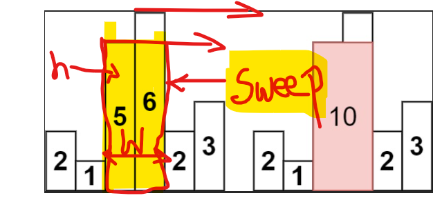
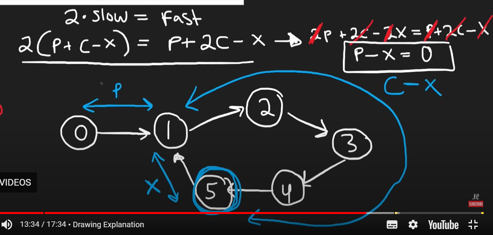
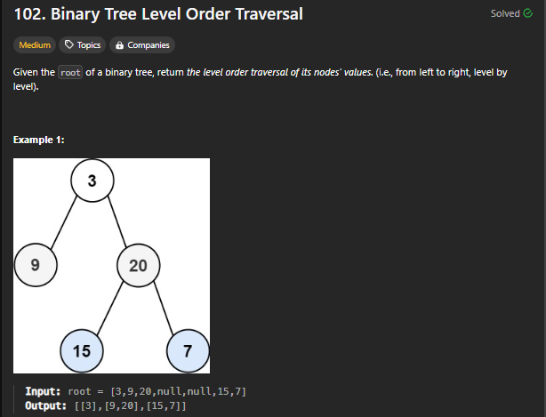

**Keywords:**
- *RT &rarr; Retry
- *NTO &rarr; Need To Optimize
# Stack and Queue
1.  **Find Next Greater Element**

    ```java
	static int [] nextLargerElement(int nums[], int n) {
        Stack<Integer> stack = new Stack<>();
        for(int i = 0;i < n;i++){
            while(!stack.isEmpty() && nums[stack.peek()] < nums[i]){
                nums[stack.pop()] = nums[i];
            }
            stack.add(i);
        }
        while(!stack.isEmpty()){
            nums[stack.pop()] = -1;
        }
    ```
    - Storing small elements until the element greater than them is found.
    - Once found replacing the greater element by poping the index of smaller element.
    - For those elements whose greater is not present will stay in Stack and in the end $-1$ will be put there.
2. **Min Stack**
    
    ```java
    Stack<Integer> stack;
    Stack<Integer> minStack;
    public MinStack() {
        stack = new Stack<Integer>();
        minStack = new Stack<Integer>();
    }
    
    public void push(int val) {
        if( stack.isEmpty() ){
            stack.push(val);
            minStack.push(val);
        }else{
            if(minStack.peek() < val){
                int count = 0;
                while(!minStack.isEmpty() && minStack.peek() < val){
                    stack.push(minStack.pop());
                    count++;
                }
                minStack.push(val);
                while(count-- != 0){
                    minStack.push(stack.pop());
                }
                stack.push(val);
            }else{
                minStack.push(val);
                stack.push(val);
            }
        }
    }
    
    public void pop() {
        if(stack.isEmpty()) stack.push(-1);
        if(minStack.isEmpty()) minStack.push(-1);
        minStack.remove(stack.pop());
    }
    
    public int top() {
        return stack.peek();
    }
    
    public int getMin() {
        return minStack.peek();     
    }
    ```
    - Maintaining Monotonic Ascending Stack `minStack` by modifying push function.
    - Such that when the `val` is pushed `minStack.peek()` values smaller than `val` is removed and stored in `stack` for a while.
    - Then, the element `val` is placed in the desired depth of stack, and rest of the elements are filled back.
3. **Maximum Frequency Stack**
    
    *RT
    ```java
    class FreqStack {
    PriorityQueue<Freq> pQ;
    Map<Integer,Integer> freqMap;
    int count = 0;
    public FreqStack() {
        pQ = new PriorityQueue<>(
            (a,b) -> {
                if(a.frequency == b.frequency) return b.counter - a.counter;
                else return b.frequency - a.frequency;
            }
        );
        freqMap = new HashMap<>();
    }
    
    public void push(int val) {
        int freq = freqMap.getOrDefault(val,0) + 1;
        freqMap.put(val,freq);
        pQ.add(new Freq(val,freq,++count));
    }
    
    public int pop() {
        Freq obj = pQ.poll();
        if(obj.frequency >= 1)
            freqMap.put(obj.value,freqMap.get(obj.value) - 1);
        else
            freqMap.remove(obj.value);
        return obj.value;
        }
    }
    class Freq{
        int value;
        int frequency;
        int counter;
        public Freq(int value,int frequency,int counter){
            this.value = value;
            this.frequency = frequency;
            this.counter = counter;
        }
    }

    ```
 - Here, I have used `counter` to mimic the behavior of Stack (The last inserted element will have highest count, thus I can arrange it in same manner in my `pQ` if two frequency is same)
 - Also, used frequency map to store and optimally access the frequency with the help of hashmap.

4. **Next Greater Element II**
    
    ```java
    public int[] nextGreaterElements(int[] nums) {
        Stack<Integer> stack = new Stack<>();
        int n = nums.length;
        int[] result = new int[n];
        Arrays.fill(result,-1);

        for(int i = 0;i < 2 * n;i++){
            while(!stack.isEmpty() && nums[i % n] > nums[ stack.peek() ]){
                result[stack.pop()] = nums[i % n];
            }
            stack.add(i % n);
        }

        return result;
    }
    ```
    - Looping in array twice as it is circular, and filling the `result` array with $-1$.
    - Because, as we are moving circular in array it is obvious that the elements for which greater elements does not exist will have their values unchanged.
    - Rest is same as *Min Stack*

5. **Online Stock Span**
    
    ```java
    public StockSpanner() {}
    
    Stack<int[]> stack = new Stack<>();
    public int next(int price) {
        int res = 1;
        while (!stack.isEmpty() && stack.peek()[0] <= price)
            res += stack.pop()[1];
        stack.push(new int[]{price, res});
        return res;
    }
    ```
    - Maintaining the Stack with counter and the price.
    - Applying method same as *Min Stack* and maintaining the counter by storing array of `{price,counter}`
    - Counter is being increased when the stocks having smaller price than present in found.
6. **Largest Rectangle in Histogram**

    ```java
    class Solution {
        public int largestRectangleArea(int[] heights) {
            int n = heights.length;
            if(n == 1) return heights[0];
            int height,width;
            int maxArea = 0;
            int start;
            Stack<IndexHeight> stack = new Stack<>();

            for(int i = 0;i < n;i++){
                start = i;
                while(!stack.isEmpty() && stack.peek().height > heights[i]){
                    IndexHeight obj = stack.pop();
                    height =  obj.height;
                    width = i - obj.index;
                    maxArea = Math.max( maxArea, height * width);
                    start = obj.index;
                }
                stack.push(new IndexHeight( start, heights[i]));
            }

            while(!stack.isEmpty()){
                IndexHeight obj = stack.pop();
                height =  obj.height;
                width = n - obj.index;
                maxArea = Math.max(maxArea,height * width);
            }
            return maxArea;
        }
    }

    class IndexHeight{
            int index;
            int height;
            public IndexHeight(int index,int height){
                this.height = height;
                this.index = index;
            }
        }
    ```
    - We will be maintaining monotonic stack here by adding heights of bar to stack until the height smaller than `stack.peek()` is found.
    - When the height is found which is smaller than `stack.peek()` first element is popped out.
    - Then, the area covered by that `bar` is calculated, by $area = height * width$ where:
        - $height = nums[i]$
        - $width = i - obj.index$
    - The sweep area is being calculated here:
        - 
    - The $height : 5$ will be taken forward and the area covered will be calculated.
7. **Task Scheduler**
    *NTO
    
    ```java
    public int leastInterval(char[] tasks, int n) {
        int[] countA = new int[26];
        int time = 0;
        int count = 0;

        PriorityQueue<Integer> pQ = new PriorityQueue<>(
            Comparator.comparingInt(a -> -a)
            );
        Queue<int[]> Q = new LinkedList<>(); //{count , time}

        for(int c : tasks)  countA[c - 'A']++;
        for(int x : countA){
            if(x > 0)   pQ.add(x);
        }
        

        while( !Q.isEmpty() || !pQ.isEmpty() ){
            time++;
            if(!pQ.isEmpty()){
                count = pQ.poll() - 1;
                if(count > 0)   Q.offer(new int[]{count,time + n});
            }
            if(!Q.isEmpty() && Q.peek()[1] == time){
                pQ.offer(Q.poll()[0]);
            }
        }
        return time;
    }
    ```
    - Maintaining  PriorityQueue based on frequency of elements.
    - Poping most frequent element and storing in another queue with time when it can be again executed. i.e, $time + n$ where $n$ is cooldown period.
     - When the cooldown period is passed, Queue is popped out and is inserted again in Priority queue.
     - The cycle goes on until all the frequency is down to $0$.
8. **K Closest Points to Origin**
    
    
    ```java
    public int[][] kClosest(int[][] points, int k) {
        PriorityQueue<int[]> pQ = new PriorityQueue<>(
            (a, b) -> (b[0] * b[0] + b[1] * b[1]) - (a[0] * a[0] + a[1] * a[1])
        );

        for(int [] point : points){
            if(pQ.size() < k){
                pQ.offer(point);
            }else{
                int currClosest = 
                    pQ.peek()[0] * pQ.peek()[0] + pQ.peek()[1] * pQ.peek()[1];

                int currPoint = 
                    point[0] * point[0]  + point[1] * point[1];

                if(currPoint < currClosest){
                    pQ.poll();
                    pQ.offer(point);
                }
            }
        }

        int[][] result = new int[k][2];
        for(int i = 0;i < k;i++){
            result[i] = pQ.poll();
        }
        return result;
    }
    ```
    - Maintaining Priority Queue of size $k$ so that tree stays of size k and  sort stays at $logk$.
    - Giving criteria of sorting such that closest point to origin $(0,0)$ stays at top of the queue.
        - Eucledian Distance : $√(x1 - x2)^2 + (y1 - y2)^2$
        - Ignoring square root : $(x1 - x2)^2 + (y1 - y2)^2$
        - Simplification : $(x1^2 + x2^2) - (y1^2 + y2^2)$
        - Comparator becomes : `(a, b) -> (b[0] * b[0] + b[1] * b[1]) - (a[0] * a[0] + a[1] * a[1])`
    - Elements are constantly added, when element found less than current element current element is removed and new element is pushed in.
    - At, the end of this operation we get out $k$ closest points to origin.
9. **Kth Largest Element in an Array**
    
    ```java
    public int findKthLargest(int[] nums, int k) {
        PriorityQueue<Integer> pQ = new PriorityQueue<>();
        for(int n : nums){
            if(pQ.size() < k){
                pQ.offer(n);
            }else if(pQ.peek() < n){
                pQ.poll();
                pQ.offer(n);
            }
        }
        return pQ.poll();
    }
    ```
    - Maintaining the *Min Heap* for size k, so that the TC for sort stays $logk$
    - Storing elements in *Min Heap* of size k so that the $k$ largest will always be at top (just visualize the largest value will be in the deepest point of `pQ`).
    - Just inverse this for *Kth Smallest element*.
    - Stats:
        - TC : $nlogk$
        - SC : $n$ 
10. **Last Stone Weight**
    
    ```java
    public int lastStoneWeight(int[] stones) {
        //Comparator.comparingInt(a -> -a) < Collections.reverseOrder()
        Queue<Integer> pQ = new PriorityQueue<Integer>(Collections.reverseOrder());
        for(int stone : stones){
            pQ.offer(stone);
        }
        int result;
        while(pQ.size() > 1){
            result = pQ.poll() - pQ.poll();
            if(result != 0)  pQ.offer(result);
        }
        return pQ.isEmpty() ? 0 : pQ.poll();
    }
    ```
    - No Explanation needed mentioned just to remember that `Collections.reverseOrder()` is much more faster than `Comparator.comparingInt(a -> -a)` for construction in *Max Heap*.
11. **Design Twitter**
    
    ```java
    class Twitter {
        Queue<Tweet> pQ;
        Map<Integer,HashSet<Integer>> userMap;
        int counter;  
        public Twitter() {
            pQ = new PriorityQueue<>((a,b) -> b.counter - a.counter);
            userMap = new HashMap<>();
            counter = 0;
        }
        
        public void postTweet(int userId, int tweetId) {
            pQ.offer(new Tweet(tweetId,userId,counter++));
            userMap.putIfAbsent(userId,new HashSet<Integer>());
        }
        
        public List<Integer> getNewsFeed(int userId) {
            List<Integer> result = new ArrayList<>();
            List<Tweet> temp = new ArrayList<>();

            while(!pQ.isEmpty() && result.size() < 10){
                Tweet tweet = pQ.poll();
                temp.add(tweet);
                if(tweet.userId == userId || userMap.get(userId).contains(tweet.userId)){
                    result.add(tweet.tweetId);
                }
            }
            pQ.addAll(temp);
            return result;
        }
        
        public void follow(int followerId, int followeeId) {
            userMap.putIfAbsent(followerId,new HashSet<Integer>());
            userMap.get(followerId).add(followeeId);
        }
        
        public void unfollow(int followerId, int followeeId) {
            userMap.get(followerId).remove(followeeId);
        }
    }

    class Tweet{
        int tweetId;
        int userId;
        int counter;

        public Tweet(int tweetId,int userId,int counter){
            this.tweetId = tweetId;
            this.userId = userId;
            this.counter = counter;
        }
    }

    /**
    * Your Twitter object will be instantiated and called as such:
    * Twitter obj = new Twitter();
    * obj.postTweet(userId,tweetId);
    * List<Integer> param_2 = obj.getNewsFeed(userId);
    * obj.follow(followerId,followeeId);
    * obj.unfollow(followerId,followeeId);
    */
    ```
    - `postTweet()` : Used *Max Heap* to store `Tweet` objects which contains Tweet sorted by attribute `counter` which depicts sequence of Tweets published. This helps us keep latest Tweets above.
    - `follow()/unfollow()`: Used `HashMap` to store user and the people he follows.Stored the followee in *Set* so that search operation will be $O(1)$
    - `getNewsFeed()`: Implemented *Max Heap* helps us here, we just need to check whether post is for any of followee or ourself and add to result.
12. **Find Median from Data Stream**
    
    ```java
    class MedianFinder {

        Queue<Double> smallPq; //Max Heap
        Queue<Double> bigPq; //Min Heap
        
        public MedianFinder() {
            smallPq = new PriorityQueue<>(Collections.reverseOrder());
            bigPq = new PriorityQueue<>();
        }
        
        public void addNum(int num) {
            smallPq.offer((double)num);
            if(!smallPq.isEmpty() && !bigPq.isEmpty() && smallPq.peek() > bigPq.peek()){
                bigPq.offer(smallPq.poll());
            }
            if(smallPq.size() > bigPq.size() + 1){
                bigPq.offer(smallPq.poll());
            }
            if(bigPq.size() > smallPq.size() + 1){
                smallPq.offer(bigPq.poll());
            }
        }
        
        public double findMedian() {
            if(smallPq.size() > bigPq.size()){
                return smallPq.peek();
            }
            if(bigPq.size() > smallPq.size()){
                return bigPq.peek();
            }
            return (smallPq.peek() + bigPq.peek()) / 2.0;
        }
    }

    ```
    - Visualize the *PriorityQueue* split into half, where each `top` of the both end will show the middle elements if size of both are equal or the one with bigger size will store `mid element` at the top of it.
    - This `top` element will be middle element in sorted elements which we can say $Median$ or else if size is equal for both part Median will be:
        - $Median = ( part1.top() + part2.top() ) / 2.0$
    - Following same thought we have written `addNum()` in such a way that:
        - We have declared `smallPq()` as a *Max heap* and `bigPq()` as a *Min heap* because if we split the *PriorityQueue* in the two half first part last element will be bigger from second part first element. This logic will further help us to sculpt our methods.
        - We first add num to `smallPq`, then we look whether `smallPq` contains all the smaller elements than `bigPq` for checking that we wrote `smallPq.peek() > bigPq.peek()`.
        - Then we look whether both of the `pQ` are of equal with approximation factor(can be 1 size greater) of $1$.
        - If not we simply `peek()` remove from the bigger part and `offer()` it to smaller part. 
        - This all helps us to maintain two split half.
    - Then we simply return `peek()` of whatever part is greater or else if both are of same size we proceed as below:
        - $Median = ( smallPq.peek() + bigPq.peek() ) / 2.0$

---
# Hash
1. **Group Anagrams**

    ```java
    public List<List<String>> groupAnagrams(String[] strs) {
        Map<String,List<String>> strMap = new HashMap<>();
        for(String x : strs){
            char[] A = x.toCharArray();
            Arrays.sort(A);
            String sortedStr = new String(A);
            strMap.putIfAbsent(sortedStr,new ArrayList<>());
            strMap.get(sortedStr).add(x);
        }
        
        List<List<String>> result = new ArrayList<>(strMap.values());
        return result;
    }
    ```
    - Just sorting every string in input and storing it in a hashmap, if similar string exist it will get added to the sorted string key list.

2. **Valid Sudoku**

    ```java
    public boolean isValidSudoku(char[][] board) {
        HashMap<Integer,Set<Character>> rows = new HashMap<>();
        HashMap<Integer,Set<Character>> cols = new HashMap<>();
        HashMap<Integer,Set<Character>> sqrs = new HashMap<>();

        for(int i = 0;i < 9;i++){
            rows.put(i,new HashSet<>());
            cols.put(i,new HashSet<>());
        }

        for(int i = 0;i < 9;i++){
            for(int j = 0;j < 9;j++){
                if(board[i][j] != '.'){
                    if(!rows.get(i).contains(board[i][j])) rows.get(i).add(board[i][j]);
                    else return false;
                } 

                if(board[j][i] != '.'){
                    if(!cols.get(i).contains(board[j][i])) cols.get(i).add(board[j][i]);
                    else return false;
                }

                if(board[i][j] != '.'){
                    int index = ( (i/3) * 10  ) + ( j / 3 );
                    sqrs.putIfAbsent(index,new HashSet<>());
                    if(!sqrs.get(index).contains(board[i][j])) sqrs.get(index).add(board[i][j]);
                    else return false;
                }
            }
        }
        return true;
    }
    ```
    - Keeping track of rows, columns and squares while traversing the matrix.
    - If the element `board[i][j]` already exists it will return false else add it to row or column hashset.
    - `int index = ( (i/3) * 10  ) + ( j / 3 );` By this we get first box of the square through which we can keep track of repeated numbers in squares.
3. **Longest Consecutive Sequence**
    
    ```java
    public int longestConsecutive(int[] nums) {
        Set<Integer> set = new HashSet<>();        
        int maxLength = 0,length;

        for(int n : nums){   set.add(n);   }        
        for(int n : set){
            if(!set.contains(n - 1)){
                length = 0;
                while(set.contains(n++)){
                    maxLength = Math.max(maxLength,++length);
                }
            }
        }
        return maxLength;
    }
    ```
    - The starting of the sequence will not have any number before it.
    - Taking same into consideration I have stored all the digits inside the set and checked for element `n` is starting of sequence.
    - If yes then went on tracking it and calculating length.
    - Here, Time Complexity will be $O(n)$ as each element is being touched at most twice, and Space Complexity $O(n)$ due to use of set.
---
# Linked List
1. **Reverse Linked List**	
    
    
    ```java
    public ListNode reverseList(ListNode head) {
        ListNode curr = head,prev = null,nxt = head;
        while(curr != null){
            nxt = curr.next;
            curr.next = prev;
            prev = curr;
            curr = nxt;
        }
        return prev;
    }
    ```
    - Take 3 pointers, `prev,curr,nxt`.
    - Make `prev` stand at last initially at `null`.
    - Make `curr` stand at head.
    - Make `nxt` stand at head next cell.
    - Then keep moving it forward with logic written in while.
1. **Merge Two Sorted Lists**	
    
    ```java
    public ListNode mergeTwoLists(ListNode list1, ListNode list2) {
        ListNode head = new ListNode(-1);
        ListNode curr = head;
        while(list1 != null && list2 != null){
            if(list1.val < list2.val){
                curr.next = new ListNode(list1.val);
                curr = curr.next;
                list1 = list1.next;
            }else{
                curr.next = new ListNode(list2.val);
                curr = curr.next;
                list2 = list2.next;
            }
        }
        while(list1 != null){
            curr.next = new ListNode(list1.val);
            curr = curr.next;
            list1 = list1.next;
        }
        while(list2 != null){
            curr.next = new ListNode(list2.val);
            curr = curr.next;
            list2 = list2.next;
        }
        return head.next;
    }
    ```
    - Just used two pointers and created new LinkedList .
1. **Reorder List**	
    
    ```java
    public void reorderList(ListNode head) {
        ListNode slow = head,fast = head.next;
        while(fast != null && fast.next != null){
            slow = slow.next;
            fast = fast.next.next; 
        }

        ListNode altNode = reverseLL(slow.next);
        slow.next = null;

        ListNode first = head;
        ListNode second = altNode;

        while(second != null){
            ListNode tmp1 = first.next;
            ListNode tmp2 = second.next;
            first.next = second;
            second.next = tmp1;
            first = tmp1;
            second = tmp2;
        }
    }

    public ListNode reverseLL(ListNode slow){
        ListNode curr = slow,prev = null,nxt = slow;
        while(curr != null){
            nxt = curr.next;
            curr.next = prev;
            prev = curr;
            curr = nxt;
        }
        return prev;
    }
    ```
    - First dividing *LinkedList* into two parts using *Tortoise and Hare* technique.
    - Reverse the second half of the array &rarr; $slow.next$.
    - Also make $slow.next$ &rarr; $null$ making sure two list are divided.
    - Then keep saving the next pointer as the link will be broken at the time of assigning alternate node (one from reversed and one from regular).
    - And keep assigning nodes alternatvily from both array.
1. **Remove Nth Node From End of List**	
    
    ```java
    public ListNode removeNthFromEnd(ListNode head, int n) {
        ListNode dummy = new ListNode(-1);
        dummy.next = head;
        ListNode fast = dummy;
        ListNode slow = dummy;

        for(int i = 0;i <= n;i++){
            if(fast == null) return head;
            fast = fast.next;
        }

        while(fast != null){
            slow = slow.next;
            fast = fast.next;
        }
        slow.next = slow.next.next;

        return dummy.next;
    }
    ```
    - Made a window of size $n$ such that when the window slides till the end, the starting of the window will be $n^t$ element from the last.
    - Here:
        - `slow` is the starting point of window.
        - `fast` is the ending point of window.
        - and distance between `slow` and `fast` is of $n$
1. **Copy List With Random Pointer**	
    
    ```java
    public Node copyRandomList(Node head) {
        Map<Node,Node> nodeMap = new HashMap<>();
        Node curr = head;
        while(curr != null){
            nodeMap.put(curr,new Node(curr.val));
            curr = curr.next;
        }
        Node dummy = new Node(-1);
        Node dummyHead = dummy;
        curr = head;
        while(curr != null){
            Node newNode = nodeMap.get(curr);
            newNode.next = nodeMap.get(curr.next);
            newNode.random = nodeMap.get(curr.random);
            dummy.next = newNode;
            dummy = dummy.next;
            curr = curr.next;
        }
        return dummyHead.next;
    }
    ```
    - Adding every node as key and duplicate `newNode` as value.
    - Making new dummy node and starting new *LinkedList* creation from same.
    - By going through old *LinkedList* again and calling the duplicate *Node* from the map and assigning that `newNode` with all the old nodes(`random,next`) value (Which are duplicates).
1. **Add Two Numbers**	
    
    ```java
    public ListNode addTwoNumbers(ListNode l1, ListNode l2) {
        ListNode dummy = new ListNode(-1);
        ListNode head = dummy;

        int sum = 0,carry = 0, dec = 0;
        while(l1 != null && l2 != null){
            sum = l1.val + l2.val + carry;
            carry = sum / 10;
            dec = sum % 10;
            dummy.next = new ListNode(dec);
            dummy = dummy.next;
            l1 = l1.next;
            l2 = l2.next;
        }

        while(l1 != null){
            sum = l1.val + carry;
            carry = sum / 10;
            dec = sum % 10;
            dummy.next = new ListNode(dec);
            dummy = dummy.next;
            l1 = l1.next;
        }

        while(l2 != null){
            sum = l2.val + carry;
            carry = sum / 10;
            dec = sum % 10;
            dummy.next = new ListNode(dec);
            dummy = dummy.next;
            l2 = l2.next;
        }

        if(carry != 0){
            dummy.next = new ListNode(carry);
        }

        return head.next;
    }
    ```
    - Performed addition in a old school way, by keeping extra integer stored in $carry$.
    - Added new *Node* for carry if any carry is left.
1. **Linked List Cycle**	
    
    ```java
    public boolean hasCycle(ListNode head) {
        if(head == null) return false;
        ListNode fast = head.next,slow = head;
        while(fast != null && fast.next != null){
            slow = slow.next;
            fast = fast.next.next;

            if(slow == fast) return true;
        }
        return false;
    }
    ```
    - 
1. **Find The Duplicate Number**
    > **Floyd's Algorithm**
    Floyd's cycle detection algorithm is an algorithm for finding the start node of a cycle in a linked list. It works by having two pointers, the slow pointer and the fast pointer, move through the linked list at different speeds. The slow pointer moves one node at a time, while the fast pointer moves two nodes at a time. If the two pointers ever meet, then there is a cycle in the linked list. If the fast pointer reaches the end of the linked list, then there is no cycle.
    
    **The distance between start of the LinkedList and Meeting Point of fast and slow pointer is always equal from the point where cycle starts.**
    
    
    ```java
    public int findDuplicate(int[] nums) {
        int slow = 0,fast = 0;
        do{
            slow = nums[slow];
            fast = nums[nums[fast]];
        }
        while(slow != fast);

        int slow1 = slow,slow2 = 0;

        do{
            slow1 = nums[slow1];
            slow2 = nums[slow2];
        }
        while(slow1 != slow2);

        return slow1;
    }
    ```
    - First running *Slow and Fast Pointer* and finding meeting point of `slow` and `fast`.
    - Then as per *Floyd's Algorithm* taking new pointer `slow2` placing it on start.
    - Then moving `slow` and `slow2` pointer node by node.
    - The point at which they meet is where cycle starts.

1. **LRU Cache**	
    
    ```java
    class LRUCache {

        private Map<Integer, Node> cache;
        private int capacity;

        private Node left;
        private Node right;

        public LRUCache(int capacity) {
            cache = new HashMap<>();
            this.capacity = capacity;

            this.left = new Node(0,0);
            this.right = new Node(0,0);

            this.left.next = right;
            this.right.prev = left;
        }

        public int get(int key) {
            if(cache.containsKey(key)){
                remove(cache.get(key));
                insert(cache.get(key));
                return cache.get(key).val;
            }else{
                return -1;
            }
        }

        public void put(int key, int value) {
            if(cache.containsKey(key)){
                remove(cache.get(key));
            }
            
            cache.put(key,new Node(key,value));
            insert(cache.get(key));

            if(cache.size() > capacity){
                Node lru = this.left.next;
                remove(lru);
                cache.remove(lru.key);
            }
        }

        // remove node from list
        public void remove(Node node) {
            Node prev = node.prev;
            Node next = node.next;

            prev.next = next;
            next.prev = prev;
        }

        // insert node at right
        public void insert(Node node) {
            Node prev = this.right.prev;
            Node next = this.right;

            prev.next = node;
            next.prev = node;

            node.next = next;
            node.prev = prev;
        }

        private class Node {

            private int key;
            private int val;

            Node next;
            Node prev;

            public Node(int key, int val) {
                this.key = key;
                this.val = val;
            }
        }
    }

    ```
    - We are maintaining Doubly LinkedList `Left`&larr;&rarr;`Right` in which Least Recently Used *Node* stays at left and moving rightward &rarr; we will see the most recently used nodes.
    - Using above algorithm below is how we solved it :
        1. Declared a *HashMap* to store the Key and Node Which points to the *LinkedList*,also declared two dummy Nodes representing `left` and `right` pointer.
        2. **put()** : Inserts the node from the left side of the *LinkedList* if the key already exists in *Hashmap* it new value (Node) is updated in *Hashmap* and the current *Node* is remove() and new *Node* is insert() from `Right` side.
        If the size grows above capacity *Least Recently Used* Node is remove() from the `Left` side.
        3. **get()** : If the key doesn't exist in the *HashMap* $-1$ is returned else the requested node is remove() and again insert() from the right side.
        4. **remove()** : As the we are maintaining *Doubly LinkedList* we are storing next and prev pointer and extending it to the next node which in itself helps us in skipping the Node.(Removing)
        5. **insert()** : We store `right` pointer and `right` previous then add the Node to `right` previous next and assign new Node next again `right` pointer maintaining the nature of  our *Doubly Linked List*.
    - Above method helps us in achieving LRU cache by maintaining the *Doubly Linked List* such it always stays sorted in such a way that LRU stays at Left and MRU stays at right.
1. **Merge K Sorted Lists**	

1. **Reverse Nodes In K Group**
    
    ```java
    public ListNode reverseLL(ListNode head,ListNode tail){
        ListNode prev = tail,nxt = null, curr = head;
        while(curr != tail){
            nxt = curr.next;
            curr.next = prev;
            prev = curr;
            curr = nxt;
        }
        return prev;
    }

    public ListNode reverseKGroup(ListNode head, int k) {
        if(head == null)    return null;
        ListNode curr = head,tail = head;
        int count = 0;
        while(tail != null && count < k){
            tail = tail.next;
            count++;
        }  
        if(count == k){
            ListNode nHead = reverseLL(curr,tail);
            curr.next = reverseKGroup(tail,k);
            return nHead;
        }
        return head;
    }
    ```
    - Traversing through $k$ Nodes maintaining head and tail of it and then reversing it, keep doing same until end is reached.
---
# Binary Tree and Binary Search Tree
1. **Invert Binary Tree**
    
    ```java
    public TreeNode invertTree(TreeNode root) {
        inOrder(root);
        return root;
    }

    public void inOrder(TreeNode root){
        if(root == null) return;

        TreeNode temp = root.left;
        root.left = root.right;
        root.right = temp;
        inOrder(root.left);
        inOrder(root.right);
    }
    ```
    - Simply swapped the nodes by performing inorder traversal.
1. **Maximum Depth of Binary Tree**
    
    ```java
    public int maxDepth(TreeNode root) {
        if(root == null) return 0;
        return Math.max(maxDepth(root.left),maxDepth(root.right)) + 1;
    }
    ```
    - Simply traversed through the depth of each side by adding 1 for every node traversed.
1. **Diameter of Binary Tree**
    
    ```java
    int maxDiameter = 0;
    public int diameterOfBinaryTree(TreeNode root) {
        calcDiameter(root);
        return maxDiameter;
    }
    public int calcDiameter(TreeNode root){
        if(root == null) return 0;

        int left = calcDiameter(root.left);
        int right = calcDiameter(root.right);

        maxDiameter = Math.max(left+right,maxDiameter);
        return 1 + Math.max(left,right);
    }
    ```
    -   As the recursive calls reached the deepest ends of both the left and right subtrees, they traversed the tree's maximum depth. 
    - While the recursion unwinds and processes the stacked calls, it concurrently counts the maximum number of nodes between the furthest left and right nodes, determining the diameter of the tree.
1. **Balanced Binary Tree**
    
    ```java
    public boolean isBalanced(TreeNode root) {
        if(root == null) return true;
        
        int left = getHeight(root.left) + 1;
        int right = getHeight(root.right) + 1;

        return Math.abs(left - right) <= 1 && isBalanced(root.left) && isBalanced(root.right);
    }

    public int getHeight(TreeNode root){
        if(root == null) return 0;
        return Math.max( getHeight(root.left),getHeight(root.right)) + 1;
    }
    ```
    - Getting the height for both the `left` and `right` side and checking whether it is $<=1$.
    - Checking this condition for every node as we can see in the return statement of isBalanced().
1. **Same Tree**
    
    ```java
    public boolean isSameTree(TreeNode p, TreeNode q) {
        if(p == null && q == null) return true;
        if(p == null || q == null) return false;
        return (p.val == q.val) && isSameTree(p.left,q.left) && isSameTree(p.right,q.right);
    }
    ```
1. **Subtree of Another Tree**
    
    ```java
    boolean flag = false;
    public boolean isSubtree(TreeNode root, TreeNode subRoot) {
        inOrder(root,subRoot);
        return flag;
    }

    public boolean isSameTree(TreeNode p, TreeNode q) {
        if(p == null && q == null) return true;
        if(p == null || q == null) return false;
        return (p.val == q.val) && isSameTree(p.left,q.left) && isSameTree(p.right,q.right);
    }

    public void inOrder(TreeNode root,TreeNode subRoot){
        if(root == null || flag == true) return;

        inOrder(root.left,subRoot);
        flag |= isSameTree(root,subRoot);
        inOrder(root.right,subRoot);
    }
    ```
    - Performing `isSameTree()` function on every node.
1. **Lowest Common Ancestor of a Binary Search Tree**
    
    ```java
    public TreeNode lowestCommonAncestor(TreeNode root, TreeNode p, TreeNode q) {
        if(root == null || root == p || root == q) return root;

        if(p.val < root.val && q.val < root.val) return lowestCommonAncestor( root.left, p, q);
        else if(p.val > root.val && q.val > root.val) return lowestCommonAncestor( root.right, p, q);
        else return root;
    }
    ```
    - As tree is BST (*Binary Search Tree*), so if the root value is less than values of `p` and `q` both then LCA must exist in greater part which is `right`.
    - if vice versa, LCA must exist in smaller part which is `left`.
1. **Binary Tree Level Order Traversal**
    
    ```java
    public List<List<Integer>> levelOrder(TreeNode root) {
        List<List<Integer>> result = new ArrayList<>();
        List<Integer> temp;

        Queue<TreeNode> q = new LinkedList<>();
        q.offer(root);

        int size = 0;
        if(root == null) return result;

        while(!q.isEmpty()){
            size = q.size();
            temp = new ArrayList<>();
            while(size-- != 0){
                TreeNode node = q.poll();
                temp.add(node.val);
                if(node.left != null)   q.offer(node.left);
                if(node.right != null)  q.offer(node.right);
            }
            result.add(temp);
        }
        return result;
    }
    ```
    - Used queue to store nodes level wise.
    - Initially adding `root` node to *Queue*.
    - Then, looking for root nodes and adding it in queue.
    - This, node are again polled until all the nodes are traversed of the present level.
1. **Binary Tree Right Side View**
    
    ```java
    public List<Integer> rightSideView(TreeNode root) {        
        List<Integer> result = new ArrayList<>();
        if(root == null) return result;

        Queue<TreeNode> q = new LinkedList<>();
        q.offer(root);

        int size,lastElement = 0; 
        while(!q.isEmpty()){
            size = q.size();
            while(size-- != 0){
                TreeNode node = q.poll();
                if(node.left != null) q.add(node.left);
                if(node.right != null) q.add(node.right);
                lastElement = node.val;
            }
            result.add(lastElement);
        }

        return result;
    }
    ```
    - As we are doing *Level Order Traversal*, we will be moving from **left to right node on the level**.
    - Hence, the last *node* we will traverse will be extreme right node which will be visible from the right side.
1. **Count Good Nodes In Binary Tree**

1. **Validate Binary Search Tree**
    
    ```java
    boolean flag = true;
    Integer prevVal;
    public boolean isValidBST(TreeNode root) {
        if( root == null ) return true;
        prevVal = null;
        inOrder(root);
        return flag;
    }

    public void inOrder(TreeNode root){
        if(root == null) return;

        inOrder(root.left);
        if(prevVal != null) flag &=  (root.val > prevVal);                
        prevVal = root.val;
        inOrder(root.right);
    }
    ```
    - The approach relies on the principle that when we perform an Inorder Traversal on a Binary Search Tree, the resulting values are arranged in ascending order. 
    - By leveraging this, we compare each previously obtained value with the current value. If, for all nodes, the previous value is smaller than the current value, the tree qualifies as a valid BST. 
    - If this condition isn't met at any point, the tree isn't a valid BST.
1. **Kth Smallest Element In a BST**
    
    ```java
    int count = 1;
    int result = 0;
    public int kthSmallest(TreeNode root, int k) {
        inOrder(root,k);
        return result;
    }

    public void inOrder(TreeNode root,int k){
        if(root == null) return;

        inOrder(root.left,k);
        if(count++ == k) result = root.val;
        inOrder(root.right,k);
    }
    ```
     - By performing In-Order traversal on BST we get sorted array.
     - We maintain count of nodes traversed, once count hits k we store the value in result.

1. **Construct Binary Tree From Preorder And Inorder Traversal**
    
    ```java
    int preorderIndex = 0;
    int inorderIndex = 0;
    public TreeNode buildTree(int[] preorder, int[] inorder) {
        return build(preorder,inorder,Integer.MIN_VALUE);
    }

    public TreeNode build(int[] preorder, int[] inorder, int stop) {
        if( preorderIndex >= preorder.length ){
            return null;
        }

        if(inorder[ inorderIndex ] == stop){
            ++inorderIndex;
            return null;
        }

        TreeNode node = new  TreeNode(preorder[ preorderIndex++ ]);
        node.left = build(preorder,inorder,node.val);
        node.right = build(preorder,inorder,stop);
        return node;
    }
    ```
    - We are taking the parent (root) from the preorder array and finding it in order by increasing inorderindex at every call.
    - When the element is found in Inorder array left tree is build, and the index gets incremented.
    ```java
    This code is attempting to construct a binary tree using its preorder and inorder traversals. Here's a step-by-step dry run:

    Given preorder traversal: `[3, 9, 20, 15, 7]`
    Given inorder traversal: `[9, 3, 15, 20, 7]`

    - `preorderIndex` and `inorderIndex` are initialized to 0.
    - `buildTree()` is called with the given preorder and inorder arrays.
    - `build()` is called recursively to construct the tree.

    ### Initial Call:
    - The first element in the preorder traversal (`3`) becomes the root node.
    - `node.left` will be built recursively until the value in the inorder traversal matches `node.val` (`3`).

    ### Recursive Calls:
    1. `build()` is called for the left subtree of node `3`.
        - The left subtree's preorder: `[9]`
        - The left subtree's inorder: `[9]`
        - `node.left` becomes a TreeNode with value `9`.
        - Since there are no more elements in the left subtree, it returns `null`.

    2. After constructing the left subtree, `build()` is called for the right subtree of node `3`.
        - The right subtree's preorder: `[20, 15, 7]`
        - The right subtree's inorder: `[15, 20, 7]`
        - `node.right` becomes a TreeNode with value `20`.
        - Recursively, the left subtree of node `20` is constructed.
            - The left subtree's preorder: `[15]`
            - The left subtree's inorder: `[15]`
            - `node.left` becomes a TreeNode with value `15`.
            - Since there are no more elements in the left subtree, it returns `null`.

        - The right subtree of node `20` is constructed.
            - The right subtree's preorder: `[7]`
            - The right subtree's inorder: `[7]`
            - `node.right` becomes a TreeNode with value `7`.
            - Since there are no more elements in the right subtree, it returns `null`.

    Finally, the constructed tree is returned.

    This code uses the concept of the preorder traversal to create the nodes of the tree and the inorder traversal to determine the boundaries of the left and right subtrees.
    ```
1. **Binary Tree Maximum Path Sum**
    
    ```java
    int result = Integer.MIN_VALUE;
    public int maxPathSum(TreeNode root) {
        dfs(root);
        return result;
    }

    private int dfs(TreeNode root){
        if(root == null) return 0;
        
        int leftMax = Math.max(dfs(root.left),0);
        int rightMax = Math.max(dfs(root.right),0);
        result = Math.max(result,leftMax + rightMax + root.val);
        return root.val + Math.max(leftMax,rightMax);
    }
    ```
    - Taking sum of left and right and then comparing it by adding root.
1. **Serialize And Deserialize Binary Tree**
    
    ```java
    StringBuilder str = new StringBuilder("");
    // Encodes a tree to a single string.
    public String serialize(TreeNode root) {
        if(root == null){
            str.append("# ");
            return "#";
        } 
        str.append(root.val).append(" ");
        serialize(root.left);
        serialize(root.right);
        return str.toString();
    }

    // Decodes your encoded data to tree.
    public TreeNode deserialize(String data) {
        return build(data.split(" "));
    }

    int index = 0;
    private TreeNode build(String[] data){

        if( data[ index ].equals("#") || data.length <= 0){
            index++;
            return null;
        } 

        TreeNode node = new TreeNode(Integer.valueOf( data[ index++ ] ));
        node.left = build(data);
        node.right = build(data);

        return node;
    }
    ```
    - Made a PreOrder string order by preorder traversal on tree and passed it to deserialize.
    - Here I have used `#` for denoting `null` nodes.
    - We are trying to build tree in same way we  traversed it (Pre Order), hence we are maintaining a index and recursively moving to right and left part of the tree.
    .jpeg>) 
     
    