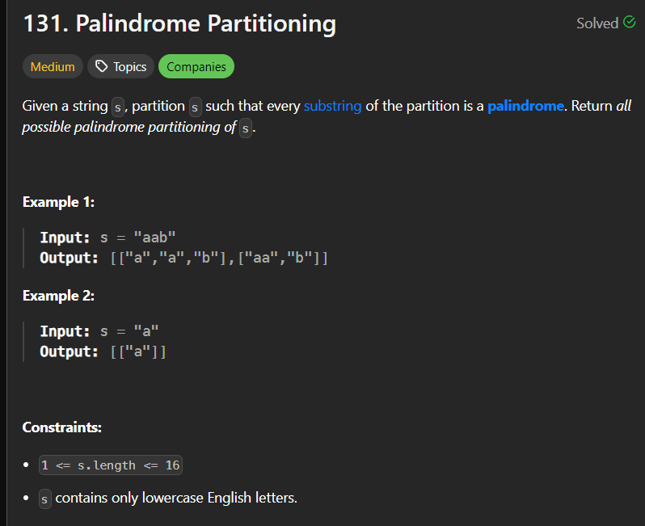

# Heap 
 > Already completed in DSA 3.
# Greedy
> It is not the Algorithm it is just a way of thinking in which a problem can be solved with minimum effort and greedly choosing the options through which we can achieve target.
1. **Maximum Subarray** **(Kaden's Algorithm)**
    
    ```java
    public int maxSubArray(int[] nums) {
        int curSum = 0;
        int maxSum = Integer.MIN_VALUE;

        for(int n : nums){
            curSum += n;
            maxSum = Math.max(curSum,maxSum);
            if(curSum < 0)  curSum = 0;
            
        }

        return maxSum;
    }
    ```
    - Solved using kadens algorithm, in which we are:
        a. Maintaining *current sum* and the *max sum* while traversing through array, initially they are set at 0 and MIN_VALUE.
        b. Once the current sum goes below it is set to 0 and max sum is being calculated at every iteration.
        c. Hence, we will get the max sum of the sub arrays.
1. **Jump Game**
    
    ```java
    public boolean canJump(int[] nums) {
        int n = nums.length;
        int goal = n - 1;
        for(int i = n - 2;i >= 0;i--){
            if((i + nums[i]) >= goal){
                goal = i;
            }
        }
        return goal == 0;
    }
    ```
    - Starting from last index greedly trying to find if we can reach to 0 index from each of the index going &larr; leftward.
    - We are checking same by adding current index with value at index i.e,`i + nums[i]) >= goal`
    - if greater than than the goal then we can reach the 0 index from that.
    - Here, goal is the distance from the current index to the 0 index.
1. **Jump Game II**
    
    ```java
    public int jump(int[] nums) {
        int left = 0,right = 0,n = nums.length;
        int farthest,result = 0;
        while(right < n - 1){
            farthest = 0;
            for(int i = left;i <= right;i++)    farthest = Math.max(farthest,nums[i] + i);
            left = right + 1;
            right = farthest;
            result++;
        }
        return result;
    }
    ```
    - I am calculating how far can I go while standing on a partcular index and taking the longest jump possible &rarr; `farthest`
    - For calculating the the `farthest` I am defining the `left` and `right` which denotes starting and ending of the range i can jump to while standing on the present index.
    - In this range I am finding index which will give me longest jump, and jump there by continuing same until second last index is reached as at that point I will be at last point.
    - This, greedy approach will be most optimal way to get minimum jumps to reach last index.
1. **Gas Station**
    
    ```java
    public int canCompleteCircuit(int[] gas, int[] cost) {
        int start = 0,totalExtra = 0,extra = 0,n = gas.length;
        for(int i = 0;i < n;i++){
            extra += gas[i] - cost[i];            
            if(extra < 0){
                totalExtra += extra;
                extra = 0;
                start = i + 1;
            }
        }
        totalExtra += extra;
        return totalExtra < 0 ? -1 : start;
    }
    ```
    - The problem relies on fact that if it is possible to complete array rotation, the sum of the whole array will be positive. $arrSum(gas[i] - cost[i]) >= 0$
    - We traverse the array by setting up 2 variables `extra` and `totalExtra`. extra helps us to get where the car can start journey from, if it gets below zero then the next index need to be considered.
1. **Hand of Straights**
    
    ```java
    public boolean isNStraightHand(int[] hand, int groupSize) {
        if( hand.length % groupSize != 0) return false;

        TreeMap<Integer,Integer> deck = new TreeMap<>();        
        for(int card : hand)    deck.put( card, deck.getOrDefault(card,0) + 1 );
        while( !deck.isEmpty() ){
            int first = deck.firstKey();
            
            if(deck.get(first) == 1) deck.remove(first);
            else deck.put(first,deck.get(first) - 1);

            int size = 1;
            while( size++ != groupSize ){
                if( deck.containsKey(++first) ){
                    if(deck.get(first) == 1) deck.remove(first);
                    else deck.put(first,deck.get(first) - 1);
                }else return false;
            }           
        }
         return true;
    }
    ```
    - Arrange all the cards in TreeMap and Greedily choose the pair of first groupSize and find out whether the consecutive exists.
1. **Merge Triplets to Form Target Triplet**
    
    ```java
    public boolean mergeTriplets(int[][] triplets, int[] target) {
        boolean firstCheck = false;
        boolean secondCheck = false;
        boolean thirdCheck = false;
        for(int[] A : triplets){
            if(A[0] <= target[0] && A[1] <= target[1] && A[2] <= target[2]){
                if(A[0] == target[0]) firstCheck = true;
                if(A[1] == target[1]) secondCheck = true;
                if(A[2] == target[2]) thirdCheck = true;
            }
        }
        return firstCheck && secondCheck && thirdCheck;
    }
    ```
    - As we know we can't compar the arrays where any of the element is bigger than target array parallel value.
    - So we can use this to only compare the arrays where the values are equal or less than value.
    - And if the target values exist at desired index then we can always make a pair.
1. **Partition Labels**
    
    ```java
    public List<Integer> partitionLabels(String s) {
        int[] lastIndexs =  new int[27];
        List<Integer> result = new ArrayList<>();
        int n = s.length();
        int lastElement = 0,index,start;;

        for(int i = 0;i < n;i++){
            index = s.charAt(i) - 'a' ;
            lastIndexs[ index ] = Math.max(lastIndexs[ index ],i);
        }        

        for(int i = 0;i < n;i++){
            index = s.charAt(i) - 'a' ;
            lastElement = Math.max(lastIndexs[ index ],lastElement);
            start = i;
           
            while(i != lastElement){   
                index = s.charAt(i) - 'a' ;             
                lastElement = Math.max(lastIndexs[ index ],lastElement);
                i++;
            }
           
            result.add(lastElement - start + 1);
        }
        return result;
    }
    ```
    - Here we  are simply traversing over the string and looking for the last occurance of current element. 
    - For that we are maintaining the Array which stores the last occurrence of element in the string.
    - And keep taking max of last occurrence and traverse till same, once the max is encountered we can consider it as whole substring which matches the condition.
1. **Determine the minimum number of trips**
    
    ```java
    public static int elevator(int N,int K,Integer[] W)
    {
        Arrays.sort(W);
        int l = 0;
        int r = W.length - 1;
        int trips = 0;

        while (l <= r) {
            if( W[l] + W[r] <= K){
                l++;                
            } 
            trips++;
            r--;
        }
        return trips;
    }
    ```
    > If we think of this incident in the real life, we will think of sending heavy students first and then if there is still space we can send light student + heavy student with it. 
    This greedy approach / thinking will make us solve this problem not only in a faster manner but much simpler too.
    For most of the Greedy problems that we encounter we need to think in same way, as we did for this.

    - Sorted the array so that heavy students are in the last.
    - Took heavy students first also looked whether we can send heavy + light student.
    - If no just send heavy student if yes send one lightest and heavy student.
1. **Valid Parenthesis String**
    - NTR
    
    ```java
    public boolean checkValidString(String s) {
        int open = 0,close = 0;
        int count = 0;
        for(char c : s.toCharArray()){
            switch(c) {
                case('('):
                    open++; // if '(' is opened it must be close so close++
                    close++;
                    break;
                case(')'):
                    if(close > 0) close--; // if there are any close brackets utilize it
                    open--; // close open ones
                    break;
                case('*'):
                    if(close > 0) close--; //if there are any close brackets utilize it
                    open++;                // utilize it to cover ')'
            }
            if(open < 0) return false; // if at any point there no open brackets left return false.
        }
        return close == 0 ; 
    }
    ```
    
    - Explained via comments and diagram.
    - Greedily looking at the condition we are evaluating how we can reduce the close bracket to 0.
# Backtracking
1. **Subsets**
    
    ```java
    public List<List<Integer>> subsets(int[] nums) {
        List<List<Integer>> result = new ArrayList<>();
        List<Integer> set = new ArrayList<>();

        createSubsets(nums,set,result,0);
        return result;
    }

    public void createSubsets(int[] nums,List set,List result,int i){
        if(i == nums.length ){
            result.add( new ArrayList<>(set) );
            return;
        }

        set.add( nums[i] );
        createSubsets(nums,set,result,i+1);
        set.remove( set.size() - 1 );

        createSubsets(nums,set,result,i+1);
    }
    ```
    
    - Intuition behind solving the following problem is *Take and Not Take* Method.
    - Consider the array of numbers and you can either take any one element of it or not take anything in your basket.
    - Recursively doing so will give us diffrent combination of the element in the array.
    - For handling the not take case we are removing the last element mimicking not take action.
1. **Combination Sum**
    
    ```java
    public List<List<Integer>> combinationSum(int[] candidates, int target) {
        List<List<Integer>> result = new ArrayList<>();
        List<Integer> set = new ArrayList<>();

        getSum(candidates,target,0,0,result,set);
        return result;
    }

    public void getSum(int[] candidates, int target,int sum,int i,List result,List set){
        if(target == sum){
            result.add(new ArrayList<>(set));
            return;
        }
        
        if(i >= candidates.length || sum > target){
            return;
        }

        set.add( candidates[i] );
        getSum(candidates,target,sum + candidates[i],i,result,set);
        set.remove( set.size() - 1 );
        
        getSum(candidates,target,sum,i+1,result,set);
    }
    ```
    - Similar to the subsets, here i took the subsets of the array with similar approach.
    - With it I also maintained the sum of each combination, by pick and not pick method.
1. **Permutations**
    
    ###### Method 1 : By using ds to store permutations.
    ```java
    public List<List<Integer>> permute(int[] nums) {
        List<Integer> ds = new ArrayList<>();
        List<List<Integer>> result = new ArrayList<>();
        boolean[] visited = new boolean[ nums.length ];
        genPermuatations(nums,ds,result,visited);
        return result;
    }

    public void genPermuatations(int[] nums,List<Integer> ds,
        List<List<Integer>> result,boolean[] visited){
        if(ds.size() == nums.length){
            result.add( new ArrayList<>(ds) );
            return;
        }

        for(int i = 0;i < nums.length;i++){
            if(!visited[i]){
                visited[i] = true;
                ds.add( nums[i] );
                genPermuatations(nums,ds,result,visited);
                ds.remove( ds.size() - 1);

                visited[i] = false;
            }
        }
    }
    ```
    
    - At each level of recursion, the function genPermutations explores all possible choices for the current position in the permutation.
    - The boolean array visited keeps track of elements already included in the current permutation.
    ###### Method 2 : By swapping the elements and adding the swapped state of array to result.
    ```java
    private void swap(int i,int j,int[] A){
        int temp = A[i];
        A[i] = A[j];
        A[j] = temp;
    }

    public List<List<Integer>> permute(int[] nums) {
        List<List<Integer>> result = new ArrayList<>();
        List<Integer> ds = new ArrayList<>();
        permutate(nums,ds,result,0);
        return result;
    }

    private void permutate(int[] nums,List<Integer> ds,List<List<Integer>> result,int index){
        if( nums.length == index ){
            for(int x : nums) ds.add( x );
            result.add( new ArrayList<>(ds) );
            ds.clear();
            return;
        }
        
        for(int i = index; i < nums.length;i++){
            swap(index,i,nums);
            permutate(nums,ds,result,index + 1);
            swap(i,index,nums);
        }
    }

    ```
1. **Subsets II**
    
    ```java
    public List<List<Integer>> subsetsWithDup(int[] nums) {
        List<List<Integer>> result = new ArrayList<>();
        List<Integer> set = new ArrayList<>();
        Arrays.sort(nums);
        makeSubsets(nums,set,result,0);
        return result;
    }

    private void makeSubsets(int[] nums,List set,List result,int i){
        if(i >= nums.length){
            result.add( new ArrayList<>( set ));
            return;
        }

        set.add( nums[i] );
        makeSubsets(nums,set,result,i + 1);
        while( i+1 < nums.length && nums[i] == nums[i+1] )  i++;


        set.remove(set.size() - 1);
        makeSubsets(nums,set,result,i + 1);
    }
    ```
    - Similar to the Subset I problem, just sorting the array and skipping the duplicate values.
1. **Combination Sum II**
    
    ```java
    public List<List<Integer>> combinationSum2(int[] nums, int target) {
        List<List<Integer>> result = new ArrayList<>();
        List<Integer> set = new ArrayList<>();
        Arrays.sort(nums);

        getSum(0,0,nums,target,result,set);
        return result;
    }

    private void getSum(int sum,int i, int[] nums,int target,List result,List set){
        if(sum > target){
            return;
        }

        if(i >= nums.length){
            if(sum == target){
                result.add( new ArrayList<>(set));
            }
            return;
        }

        set.add(nums[i]);
        sum += nums[i];

        getSum(sum,i + 1,nums,target,result,set);
        sum -= (int) set.remove( set.size() - 1);
        
        
        while(i + 1 < nums.length && nums[i + 1] == nums[i]) i++;
        getSum(sum,i + 1,nums,target,result,set);
    }
    ```
    - Same as combination sum I, just sorting the array and skipping the duplicate values.
    - Also taking sum outside param as it is much faster, god knows why.
1. **Word Search**
    
    > Started from 1 because the initial point is already found which itself means first character of the word is already found.
    ```java
    boolean[][] visited;
    int rowL;
    int colL;
    public boolean exist(char[][] board, String word) {
        int n = (rowL = board.length);
        int m = (colL = board[0].length);
        visited = new boolean[n][m];

        if(rowL == 1 && colL == 1 && word.length() == 1 ){
            if(word.charAt(0) == board[0][0]) return true;
            return false;
        }

        for(int i = 0;i < rowL;i++){
            for(int j = 0;j < colL;j++){
                if(board[i][j] == word.charAt(0))
                    if(isPresent(board,word,i,j,1)) return true;
            }
        }
        return false;
    }
    private boolean isPresent(char[][] board,String word,int row,int col,int index){
        if(index == word.length()) return true;
        char ch = word.charAt(index);
        visited[row][col] = true;

        //UP
        if(row + 1 < rowL && board[row + 1][col] == ch && !visited[row+1][col]){
            if(isPresent(board,word,row + 1,col,index + 1)) return true;
        }
        //DOWN
        if(row - 1 >= 0 && board[row - 1][col] == ch && !visited[row-1][col]){
            if(isPresent(board,word,row - 1,col,index + 1)) return true;
        }
        //LEFT
        if(col - 1 >= 0 && board[row ][col-1] == ch && !visited[row][col-1]){
            if(isPresent(board,word,row,col-1,index + 1)) return true;
        }
        //RIGHT
        if(col + 1 < colL && board[row][col + 1] == ch && !visited[row][col + 1]){
            if(isPresent(board,word,row,col + 1,index + 1)) return true;
        }
        visited[row][col] = false;
        return false;
    }
    ```
    - Trailing &larr; &darr; &uarr; &rarr; from all the locations where there is initial point which is `word.charAt(0)`.
    - Continuously recursing from the initial point wherever the next character is found and incrementing the index for next char to be found.
    - Once the index hit the length of String provided `word` then we can return it as true.
1. **Palindrome Partitioning**
    
    ```java
    List<List<String>> result;
    List<String> set;
    public List<List<String>> partition(String s) {
        result = new ArrayList<>();
        set = new ArrayList<>();
        makePartitions(s,0,s.length());
        return result;
    }

    private void makePartitions(String s,int l,int n){
        if(l == n) {
            result.add(new ArrayList<>(set));
            return;
        }        

        for(int i = l;i < n;i++){
            if( isPalindrome( s.substring(l,i+1) ) ){
                set.add(s.substring(l,i+1));
                makePartitions(s,i+1,n);
                set.remove(set.size() - 1);
            }
        }
    }

    private boolean isPalindrome(String str){
        int i = 0,j = str.length()-1;
        while(i <= j){
            if( str.charAt(i++) != str.charAt(j--) ) return false;
        }
        return true;
    }
    ```
    


    1. **Check every position:** We iteratively start from each character in the string.
    2. **Grow palindromes:** If a substring starting at that position is a palindrome, we add it to a list and keep checking longer palindromes starting one character later.
    3. **Recurse on remaining string:** For each found palindrome, we recursively call the same process on the remaining part of the string.
    4. **Build all partitions:** By combining palindromes from different starting positions, we build all possible ways to partition the string into palindromes.

    Think of it like building blocks: you check different starting points, "stick" valid palindromes together, and explore remaining pieces through recursion until the whole string is covered. This gives you all ways to split the string into palindromes!

1. **Letter Combinations of a Phone Number**
    
    ```java
    public List<String> letterCombinations(String digits) {
        List<String> result = new ArrayList<>();
        if (digits.length() == 0) return result;

        String[] pad = { "", "", "abc", "def", "ghi", "jkl", "mno", "pqrs", "tuv", "wxyz" };
        combineLetters(digits, pad, result, new StringBuilder(), 0);
        return result;
    }

    private void combineLetters(String digits, String[] pad, List<String> result, StringBuilder str, int index) {
        if (str.length() == digits.length()) {
            result.add(str.toString());
            return;
        }

        int digit = digits.charAt(index) - '0';
        for (int i = 0; i < pad[digit].length(); i++) {
            str.append(pad[digit].charAt(i));
            combineLetters(digits, pad, result, str, index + 1);
            str.deleteCharAt(str.length() - 1); // Backtrack by removing the last character
        }
    }
    ```
    
    - Recursively keep building the string using one letter from one key and combining it with other key's letters.
    - Base case : when the string is same as length of digits save it and remove last one.
    - *Time Complexity :* $O(n*4^n)$ / $O(n*3^n)$ &rarr; In current case.
    - *Space Complexity :* $O(n)$
1. **N Queens**
    
    ```java
    List<List<String>> result;
    public List<List<String>> solveNQueens(int n) {
        result = new ArrayList<>();
        int[][] board = new int[n][n];

        placeQ(board,0,n);
        
        return result;
    }

    private void placeQ(int[][] board,int row,int n){
        if(row == n){
            addToList(board,n);
            return;
        }

        for(int i = 0;i < n;i++){
            if(isValid(board,row,i)){
                board[row][i] = 1;
                placeQ(board,row+1,n);
                board[row][i] = 0;
            }
        }
    }

    private boolean isValid(int[][] board,int row,int col){
        int R = row,C = col,n = board.length;

        //Vertical
        for(int[] A : board){
            if(A[col] == 1) return false;
        }
        //Left Diagonal
        while(R >= 0 && C < n){
            if(board[R--][C++] == 1) return false;
        }

        //Right Diagonal
        R = row; C = col;
        while(R >= 0 && C >= 0){
            if(board[R--][C--] == 1) return false;
        }

        return true;
    }

    private void addToList(int[][] board,int n){
        List<String> temp = new ArrayList<>();
        for(int i = 0;i < n;i++){
            StringBuilder sb = new StringBuilder();
            for(int j = 0;j < n;j++){
                sb.append(board[i][j] == 0 ? "." : "Q");
            }
            temp.add(sb.toString());
        }
        result.add(temp);
    }
    ```
    - We are simply creating a 2D matrix of $n * n$ dimension mimicking chess board.
    - Then we start by checking each row starting from first row (0).
    - We check in each row that there should be no Queen `Q` placed diagonally left or right or vertical below.
    - Below because its all the queens we placed till now, if there is any queen present already we don't place queen there.
    - Here we are using backtracking to get all possible combinations of placing the queen.
    - In the end we are just processing our result and providing output in desired way.
# Graphs

**Traversal:**

- **Breadth-First Search (BFS):** Explores a graph layer by layer, finding all nodes at a certain level before moving to the next.
    - Applications: Finding shortest paths in unweighted graphs, checking for bipartiteness, detecting cycles in undirected graphs.
    ```java
    HashMap<Integer, List<Integer>> graph;

    public void bfs(int start) {
        Queue<Integer> queue = new LinkedList<>();
        boolean[] visited = new boolean[graph.size()];

        queue.add(start);
        visited[start] = true;

        while (!queue.isEmpty()) {
            int node = queue.poll();
            System.out.print(node + " ");

            for (int neighbor : graph.get(node)) {
                if (!visited[neighbor]) {
                    queue.add(neighbor);
                    visited[neighbor] = true;
                }
            }
        }
    }

    ```

- **Depth-First Search (DFS):** Explores a graph as deeply as possible along each branch before backtracking.
    - Applications: Finding connected components, Topological sorting, detecting cycles in directed graphs.
    ```java
    HashMap<Integer, List<Integer>> graph;

    public void dfs(int start, boolean[] visited) {
        visited[start] = true;
        System.out.print(start + " ");

        for (int neighbor : graph.get(node)) {
            if (!visited[neighbor]) {
                dfs(neighbor, visited);
            }
        }
    }
    ```

**Shortest Path:**

- **Dijkstra's Algorithm:** Finds the shortest path from a source node to all other nodes in a weighted graph (non-negative weights).
    - Applications: Navigation systems, network routing, finding arbitrage opportunities.

- **Bellman-Ford Algorithm:** Similar to Dijkstra's but can handle graphs with negative edge weights.
    - Applications: Finding optimal paths with tolls, identifying negative cycles.

**Minimum Spanning Tree:**

- **Prim's Algorithm:** Greedily constructs a minimum spanning tree (MST) by adding the lightest edge that doesn't create a cycle.
    - Applications: Network design, image segmentation, phylogenetic tree construction.

- **Kruskal's Algorithm:** Similar to Prim's but sorts edges beforehand and picks the lightest that doesn't create a cycle.
    - Applications: Same as Prim's, often preferred for larger graphs.

**Other Important Algorithms:**

- **Topological Sort:** Orders nodes in a directed acyclic graph (DAG) such that for every directed edge (u, v), u comes before v.
    - Applications: Scheduling tasks with dependencies, resolving module imports.

- **Floyd-Warshall Algorithm:** Finds the shortest paths between all pairs of nodes in a weighted graph (can handle negative weights).
    - Applications: Finding all-pairs shortest paths in road networks, routing in dynamic networks.

- **Max-flow Min-cut Algorithm:** Finds the maximum flow that can be sent through a network and the minimum cut that separates the source and sink.
    - Applications: Network traffic optimization, resource allocation, image segmentation.
----
## Problems
1. **Number of Islands**
1. **Clone Graph**
1. **Max Area of Island**
1. **Pacific Atlantic Water Flow**
1. **Surrounded Regions**
1. **Rotting Oranges**
1. **Walls And Gates**
1. **Course Schedule**
1. **Course Schedule II**
1. **Redundant Connection**
1. **Number of Connected Components In An Undirected Graph**
1. **Graph Valid Tree**
1. **Word Ladder**

----

### How recursive call works ?

 **Here's a breakdown of how the `return` statement works in recursion:**

**1. Initiating a Recursive Call:**

- When a function calls itself recursively, it creates a new instance of itself with its own variables and execution context.
- Think of it like a stack of function calls, where each new recursive call is added to the top of the stack.

**2. Reaching a Base Case:**

- Every recursive function needs a base case to stop the recursion and prevent infinite loops.
- When a base case is met, the function doesn't make further recursive calls. Instead, it returns a value (or `void` if it doesn't return anything).

**3. Returning from a Recursive Call:**

- When a recursive call returns, it passes control back to the function that called it (the previous call on the stack).
- It also passes back any value it might have returned using the `return` statement.
- This allows each recursive call to build upon the results of previous calls.

**4. Unwinding the Recursion Stack:**

- As each recursive call returns, it's removed from the stack.
- The variables and execution context of that call are also discarded.
- This process continues until the original function call that initiated the recursion also returns.

**Key Points:**

- The `return` statement doesn't immediately jump to the last function call. It returns to the immediate caller, which might be another recursive call.
- The order of returns follows a Last-In, First-Out (LIFO) pattern, similar to a stack.
- Each recursive call has its own variables and execution context, isolated from other calls.
- Recursion is a powerful tool for solving problems that can be divided into smaller, self-similar subproblems.

**Example:**

Consider this simple recursive function to calculate factorials:

```java
int factorial(int n) {
    if (n == 0) {
        return 1; // Base case
    } else {
        return n * factorial(n - 1); // Recursive call
    }
}
```

When you call `factorial(5)`:

1. `factorial(5)` calls `factorial(4)`.
2. `factorial(4)` calls `factorial(3)`.
3. This continues until `factorial(0)` is reached (base case).
4. `factorial(0)` returns 1 to `factorial(1)`.
5. `factorial(1)` returns 1 * 1 = 1 to `factorial(2)`.
6. And so on, each call returning the calculated value to its caller.
7. Finally, `factorial(5)` returns 5 * 4 * 3 * 2 * 1 = 120.

---

**Yes, you're right!** Each function call stored in the recursion stack represents a snapshot of the program's state at that particular point in the recursive execution. This includes:

**1. Function Arguments:**
- The values that were passed to the function when it was called.
- These values might vary for different recursive calls, allowing each call to work on distinct parts of the problem.

**2. Local Variables:**
- Variables declared within the function itself.
- Each recursive call has its own set of local variables, preventing conflicts between calls.
- This enables each call to operate independently, even though they share the same function code.

**3. Execution Point:**
- The line of code where the function paused before making the recursive call.
- When a function returns, it resumes execution from this point, allowing the caller to continue processing.

**4. Return Address:**
- The memory address where the function should return control after it finishes executing.
- This ensures that each recursive call returns to its correct caller, maintaining the proper flow of execution.

**Think of the recursion stack as a timeline of function calls:**

- Each new recursive call adds a new frame to the stack, representing its own state.
- When a function returns, its frame is removed from the stack, and the program resumes execution from the previous frame.
- This process continues until all recursive calls have returned, and the original function call has finished.

**In essence, the recursion stack effectively manages multiple instances of the same function, preserving their states and ensuring proper execution flow even when functions call themselves recursively.**
